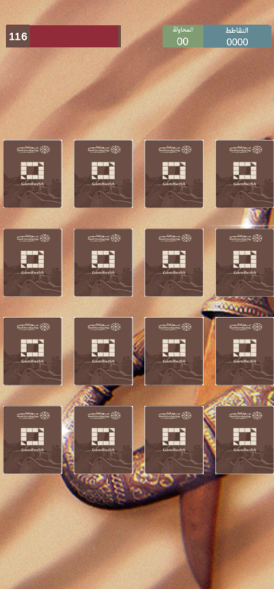

<!-- PROJECT LOGO -->

<h3>   
Memory card - foundation day theme

   
  

</h3>   

   

 

 

 

 

 

## Project Info
**Role:** Game Programmer
 
**Team Size:** 3
 
**Duration:** 1 week
 
**Tech:** Unity, C#, PlayFab 

> [!NOTE]
> **Installation GUIDE:**
>  
> Unity Version: 2023.1.10f1

## Overview
During my time at Gamifier, I worked on a memory card game developed to celebrate Saudi Foundation Day with players.
I was responsible for implementing the leaderboard system using PlayFab, enabling real-time score tracking and player rankings. In addition to backend programming, I also handled art integration, adjusting and implementing visual assets to match the game’s layout and theme. This project combined cultural celebration with engaging gameplay to create a festive and interactive player experience.

